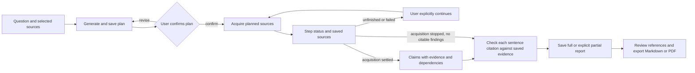

[English](workflows.md) | [简体中文](workflows.zh-CN.md) · [Documentation](README.md)

# Workflows

**Chats**, **Invoices** and **Deep Research** continue to use AgentSession. Use the independent **Personal Agent** entry for ongoing invoice work with Pi Durable.

## Ask about local information

1. Configure a model, then use **New chat** in the left navigation to open a new main conversation, or select an existing one from recent chats or **Chats**.
2. Supply text, select authorized materials or choose the intended working directory. Say what the Agent should inspect and what constitutes an answer.
3. Send once and watch the actual Run/tools. A selected directory determines execution location, not an OS sandbox; native command/write tools may be available.
4. Check the answer against source text. Open Session Details/Context and tool evidence when a citation, material version or execution claim is unclear.
5. Continue with a new input if needed. Reopening history does not resend an old request.

If evidence is missing, ask for the gap rather than a guessed fact. For independent reasoning on supplied text, enable the extension and use `general-analyst`; its no-tool definition cannot verify outside facts. See [Subagents](subagents.md).

## Deep Research

Research reads selected local `.txt` and `.md` material and registered parsed documents. **Web search** defaults to off for each new task. Set `FLOWMATE_TAVILY_API_KEY` in the executing Host's startup environment and restart it to enable the switch. Desktop local mode inherits the value from the desktop launcher. Set the variable in the Windows service startup environment for WinSW.

```mermaid
flowchart LR
  Input[Question and selected sources] --> Plan[Generate and save plan]
  Plan --> Confirm{User confirms plan}
  Confirm -->|revise| Plan
  Confirm -->|confirm| Read[Acquire planned sources]
  Read --> Evidence[Step status and saved sources]
  Evidence -->|unfinished or failed| Continue[User explicitly continues]
  Continue --> Read
  Evidence -->|acquisition settled| Claims[Claims with evidence and dependencies]
  Claims --> Check[Check each sentence citation against saved evidence]
  Evidence -->|acquisition stopped, no citable findings| Check
  Check --> Report[Save full or explicit partial report]
  Report --> Review[Review references and export Markdown or PDF]
```

1. Optionally open **Settings → General → Research preferences**, enter the desired evidence or report preferences, and select **Save research preferences**. The default is empty and the text is limited to 8,192 UTF-8 bytes; each research Run captures the saved text and revision. Saving does not start a model call.
2. Open **Deep Research → New research**, enter the question and optional scope, and import or select authorized local material or parsed documents as needed. Enable **Web search** if the task needs public webpages. Select **Create research**, then **Send** in the linked Assistant to generate a plan. The currently selected invoice is not added automatically.
3. Inspect the saved Plan's questions, evidence needs, source scope, budget and stop conditions. A plan with steps binds each acquisition to its questions and one selected material, query or public URL. With web search enabled, **Web requests to Tavily** lists the saved plan's search terms, time ranges, result ranks and specified public URLs for review. Use **Revise plan** if necessary, then explicitly select **Confirm plan version** to start investigation. Changing the authorized material selection requires a new research task.
4. For a plan with steps, inspect **Research steps** and the saved-source links. Local reads, web searches and page extraction share **two** active acquisition slots per task, including reads delegated to `research-investigator` children. This is separate from the limit of four owned children. The parent runs the confirmed Tavily steps and saves Claims and reports. Search tries live fetching first. If the selected rank has no candidate, Flowmate repeats discovery once with the confirmed query, date constraints and rank, then extracts the selected webpage. If a selected search result has no body, Flowmate extracts that URL directly.
5. Open **Report** and choose a version in **Saved report**. Click a marker such as `[1]` to see its source snapshot, exact quotation, UTF-16 character range, acquisition time and Run / ToolCall. Use **View saved passage** to open the text in **Evidence**, **Open Claim** to inspect its supporting or refuting evidence and dependencies, or **Open webpage** for a web source. Web snapshots retain the page text, URL, acquisition time and source date when available.
6. Choose Markdown or PDF under **Export format**, then select **Save report**. Both formats retain the sentence markers and References appendix. In a PDF, clicking a marker jumps to its entry. Historical reports with section-level citations remain readable and exportable as Markdown. Generate a new report to export PDF.

Every sentence in a new report's answer, conclusions and section body requires a citation to a specific evidence entry on a saved Claim. Before saving, Flowmate checks the Claim and plan, compares the quote with the saved snapshot at the recorded UTF-16 offsets (start inclusive, end exclusive), and checks the acquisition Run / ToolCall IDs against the successfully completed tool call. If a citation is missing or fails these checks, the report is not saved. This check requires no additional model call.

A full report requires successful planned acquisitions and support for the planned questions. Once active acquisitions stop, a partial report can record failed or unfinished steps, limitations, conflicts and unresolved questions separately from the body. If there are no citable findings, the partial report can leave its body empty and record the gaps.

For a plan with steps, the checkpoint displays `pending`, `running`, `succeeded`, `failed` or `interrupted`. Success requires a successful tool receipt, confirmed cleanup and a saved source; a model's statement is not a receipt. Claim saving is blocked while a step remains pending, running or interrupted. A failed step remains visible for diagnosis and prevents a full report until it succeeds.

When a confirmed plan has pending, failed or interrupted steps, **Continue research** is shown. It can be enabled only when the selected research Session, model and runtime are ready, no Run is active, and the page is not loading or saving. It starts an explicit new investigation Run using the confirmed plan: a succeeded step reuses its original saved source if that source remains available, while remaining eligible steps can be attempted. A prior step whose stopping is unconfirmed remains blocked; inspect the original Run and ToolCall instead of starting a replacement blindly. Merely reopening the page or querying history does not run the model or replay a tool call. After restart, a valid saved research focus can be restored, but a later user selection is not replaced by a delayed restore.

Older plans without `steps` remain readable and use their original read/query flow; they do not automatically gain a step list. To use step tracking, generate and confirm a new plan. See [Agent runtime](agent-runtime.md#context-memory-layers) for the different lifetimes of focus, history, preferences and checkpoint.

Source location validity is not semantic correctness. A Report's own coverage is a product result, not an independent quality score. A completed investigation Run without a saved report is not a delivered report. Use [Evaluation](EVALUATION.md) for independent evidence and multi-hop quality checks.

## Invoice review

Prepare the original invoice and externally generated parsing material. Development import uses `data/invoices/agent-input/`; installed imports use the product data root's `imports/invoices/`. Keep the original/parsed association intact. The Host registers and reads material; it does not parse original invoices itself.

```mermaid
flowchart LR
  Import[Import original and parsed material] --> Inspect[Original / Parsed / Results]
  Inspect --> Run[Process this invoice then Send]
  Run --> Candidate[Saved candidate]
  Candidate --> Review[Review fields and source evidence]
  Review --> Edit[Optional Fill with Agent or human Edit]
  Edit --> Save[Save reviewed version]
  Save --> Accept[Accept result]
  Accept --> Export[JSON / CSV / Markdown export]
```

1. Open **Invoices** from the left navigation, import the prepared material and inspect **Original / Parsed / Results**. The right-side Assistant accompanies the invoice workspace.
2. Click **Process this invoice**, then **Send** in Assistant. Processing and candidate saving have actual Run/ToolCall records.
3. Select the candidate. Compare header fields, line items, amounts, uncertainties and source locations with the original and parsed evidence.
4. Use **Fill with Agent** to invoke the real form operation, or **Edit** for human changes. Fill requires the original candidate/target/revision and a matching application receipt; a tool request alone does not prove the UI was filled.
5. Save reviewed edits, explicitly **Accept result**, then export JSON, CSV or Markdown. A generated candidate, human edit, saved version, accepted result and external exported copy are different facts.

Unsaved edits live in the current window and do not survive restart; follow Save/Discard prompts when leaving. Unknown write/fill receipts should be queried through the original operation before retrying. A visible form value does not replace a saved candidate or acceptance record.

An optional `invoice-evidence-checker` can inspect fixed-scope source evidence but cannot save candidates, fill forms or accept results. `/parallel-invoice-review` requests evidence and reasoning checks; inspect actual child cards before treating both checks as completed. Detailed constraints are in [Subagents](subagents.md).

## Personal Agent: ongoing invoice work

For configuration, execution objects and recovery details, see the dedicated [Personal Agent guide](personal-agent.md).

Choose the local workspace or [connect to a cloud workspace](personal-agent.md#cloud-workspace) before submitting Work. Eligible cloud execution can continue while its services are running. Local execution after desktop closure and Windows startup recovery require separate system acceptance.

1. Open **Personal Agent** and confirm/save its model, tool and resource configuration. Then select a fixed set of existing parsed invoices, enter the goal and explicitly submit the work. Creation is available only here; **Invoices** retains single-invoice selection and editing. New invoices require new work rather than silently enlarging the saved set.
2. Review the Work overview and per-invoice Todo. Provide requested clarification or authorized material and inspect whether it was saved, authorized for execution or blocked. After a stopped or failed attempt, use **Continue work** when eligible.
3. Use **View original invoice / review** to compare the candidate with its sources. Choose **Accept result** in local **Invoices** or **Accept candidate** in the cloud review panel. Return to the Work and choose **Attach confirmed acceptance**. To end an item as rejected or excluded, use its explicit disposition action and provide a reason. Rejecting a candidate alone does not end the item.
4. Inspect attempts and saved evidence. **Stop current attempt** and **Cancel entire work** are different actions; each invoice needs a final disposition and required writes and execution must settle before the Work completes. Viewing history does not start a model call.

The parent may delegate an invoice evidence question to a bounded read-only child. See [Subagents](subagents.md) for the Durable path and [Personal Agent](personal-agent.md) for stopping, recovery and related work.

If the initial attempt has closed and the original candidate and evidence are available, preview what an [independent invoice review](personal-agent.md#personal-peer-review) would share before confirming it. For interactive tools, use the [approval and reconnection flow](personal-agent.md#personal-approvals). Use **Timeline** to distinguish business receipts from model observations and [Long-term memory](agent-runtime.md#openviking-memory) to manage authorized memory for new chats or Work.

## When to stop and inspect

Stop if material permissions no longer match, execution stopping is unconfirmed, or required history/persistence is unavailable. Keep the original error, Run/ToolCall and artifact identities. Do not rerun an operation merely to replace an unclear status. [Runtime](agent-runtime.md) explains the facts; [Packaging and recovery](packaging-and-recovery.md) explains data recovery.
